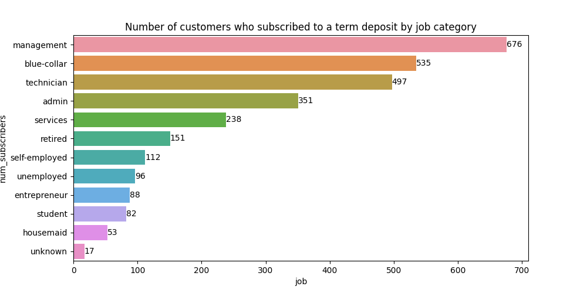
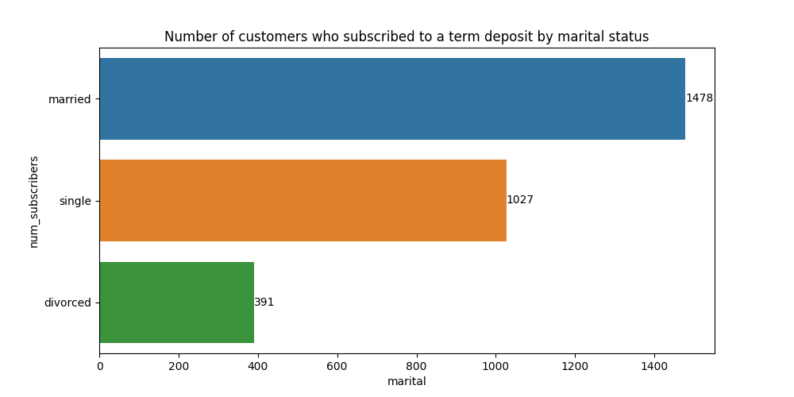
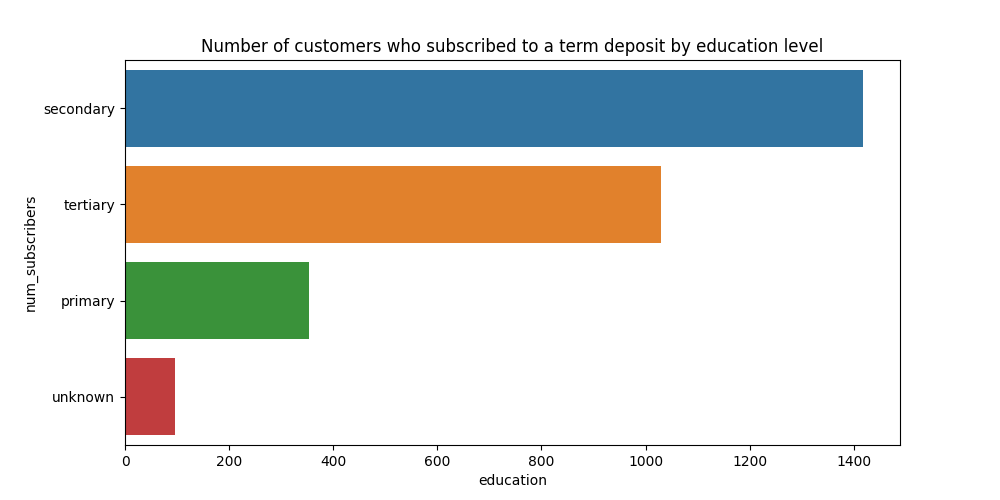
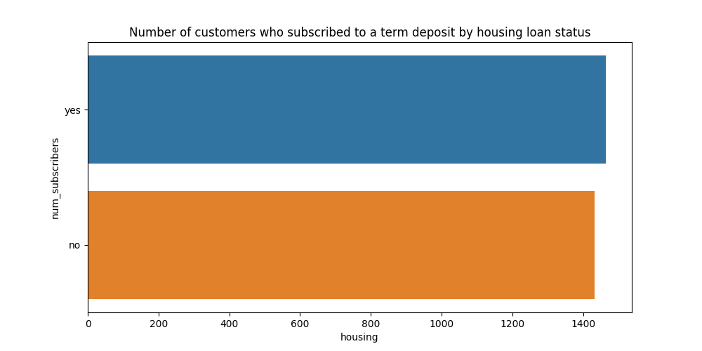
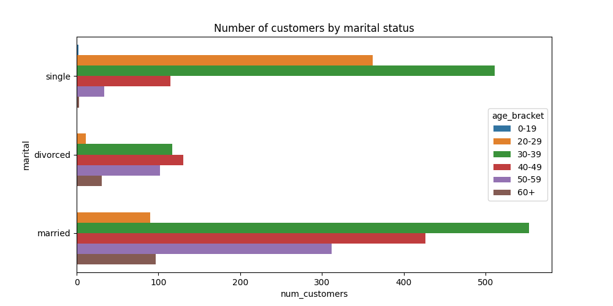

Success rate improvement
==============================

## Data Description

Data Description:

The data comes from direct marketing efforts of a European banking institution. The marketing campaign involves making a phone call to a customer, often multiple times to ensure a product subscription, in this case a term deposit. Term deposits are usually short-term deposits with maturities ranging from one month to a few years. The customer must understand when buying a term deposit that they can withdraw their funds only after the term ends. All customer information that might reveal personal information is removed due to privacy concerns.

### Attributes:

| Column	|Description|
|-|-|
|age	|Age of customer (numeric)|
|job	|Type of job (categorical)|
|marital	|Marital status (categorical)|
|education	|Education level (categorical)|
|default	|Has credit in default? (binary)|
|balance	|Average yearly balance, in euros (numeric)|
|housing	|Has a housing loan? (binary)|
|loan	|Has personal loan? (binary)|
|contact	|Contact communication type (categorical)|
|day	|Last contact day of the month (numeric)|
|month	|Last contact month of the year (categorical)|
|duration	|Last contact duration, in seconds (numeric)|
|campaign	|Number of contacts performed during this campaign and for this client (numeric, includes last contact)|

### Output (desired target):

$y$ - has the client subscribed to a term deposit? (binary)

### Goal(s):

- Predict if the customer will subscribe (yes/no) to a term deposit (variable y)
- Find customers who are more likely to buy the investment product. Determine the segment(s) of customers our client should prioritize.
- What makes the customers buy? 

## Exploratory data analysis

### Find the number of customers who subscribed to a term deposit (y = 'yes') by job category

It appears that the group of customers subscribed to a term deposit were predominantly workers in management positions, followed by workers in blue-collar positions, technicians and workers in admin roles. 

Representation decreases dramatically for employees in services, or employees who are either retired, self employed, unemployed, a student, or a housemaid. 

This suggests that subscribed customers may enjoy higher income stability. 

### Find the number of customers who subscribed to a term deposit (y = 'yes') by marital status:

Customers whose marital status is married, also subscribed to a term deposit at higher rate than single or divorced customers. It is worth noting that there were at least 3 times as many single customers that divorced customers. 

### Find the number of customers who subscribed to a term deposit (y = 'yes') by education level:

The two most prominent levels of education completed by customers subscribed to a term deposit was secondary education, followed by tertiary education (university, trade schools, colleges).

### Find the number of customers who subscribed to a term deposit (y = 'yes') by housing loan status:

The breakdown of customers with a term deposit is broken down quite similarly, when breaking them down by housing loan status (did have a loan status, or did not have a loan status).

### Find the number of customers who subscribed to a term deposit (y = 'yes') by age bracket and marital status:

Customers between 30 and 39 appeared to represent a large percentage of customers with a term deposit, whether they were single or married. Of those customers that were single, customers aged 20 to 29 were the next most represented group. Of those customers that were married, those aged 40-59 were the next most represented group. 

## Building a model to answer the questions:

- Predict if the customer will subscribe (yes/no) to a term deposit (variable y)
- Find customers who are more likely to buy the investment product. Determine the segment(s) of customers our client should prioritize.
- What makes the customers buy? 

### Data preprocessing

No missing information was found. Data contained both numerical and categorical attributes. 

### Pipeline development

[Download Page](/notebooks/pipeline_diagram.png)

<small>Project based on the <a target="_blank" href="https://drivendata.github.io/cookiecutter-data-science/">cookiecutter data science project template</a>. #cookiecutterdatascience</small>

